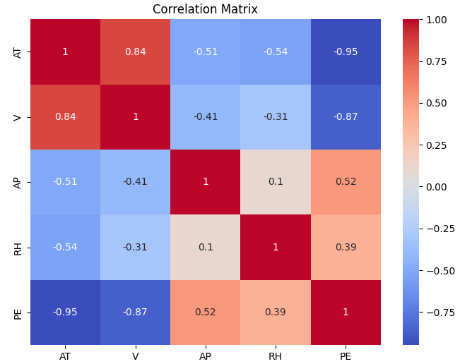

# Power Output Prediction with Machine Learning  
**Final Project – Duke University AI Product Management Specialization**

Author: **Federico Silvera**  
Role: **Senior Product Manager**

---

This repository contains the final project for the *Machine Learning Foundations for Product Managers* course, part of the **AI Product Management Specialization by Duke University**.

The project demonstrates the application of machine learning techniques to solve a real-world regression problem: predicting the net hourly electrical power output of a Combined Cycle Power Plant (CCPP) based on environmental factors.

---

## Project Presentation Video

Watch the full project walkthrough on YouTube:

👉 [Final Project Presentation](https://youtu.be/KCz7heIsqik)

> In this video, I explain the problem, approach, models, results, and key learnings from this machine learning project.


## Problem Overview

The objective is to predict the **net electrical power output (PE)** using four key environmental variables:

- `AT` – Ambient Temperature (°C)  
- `V`  – Exhaust Vacuum (cm Hg)  
- `AP` – Ambient Pressure (millibar)  
- `RH` – Relative Humidity (%)  

This is a **supervised regression problem**, where the target variable is continuous.

---

## Dataset

- **9,568** hourly records collected over 6 years from a real CCPP.
- Each record includes environmental conditions and actual power output.
- Source: [Machine Learning Repository – CCPP Dataset](https://storage.googleapis.com/aipi_datasets/CCPP_data.csv)

---

## Models Used

Two machine learning models were implemented and evaluated:

- **Linear Regression** – selected as a simple and interpretable baseline.
- **Random Forest Regressor** – used to capture non-linear relationships and feature interactions.

---

## Evaluation Metrics

The following metrics were used to assess model performance:

- **Mean Squared Error (MSE)**
- **Root Mean Squared Error (RMSE)**
- **R² Score**
- **5-Fold Cross-Validation**

---

## Results

| Model              | CV MSE (Train) | CV RMSE (Train) | Test MSE | Test RMSE | R² Score (Test) |
|--------------------|----------------|------------------|-----------|-------------|------------------|
| Linear Regression  | 20.911 ± 0.741  | 4.572 ± 0.080     | 20.247    | 4.503       | 0.930            |
| Random Forest      | 12.012 ± 1.028  | 3.463 ± 0.150     | **10.494**| **3.239**   | **0.964**        |

> **Random Forest** significantly outperformed Linear Regression

---

## Sample Visualizations

**Actual vs Predicted (Test Set)**  


**Correlation Matrix**  


---

## How to Run

1. Clone the repository:

   ```bash
   git clone https://github.com/fedesilverauy/duke-ml-product-course-project.git
   cd duke-ml-product-course-project

