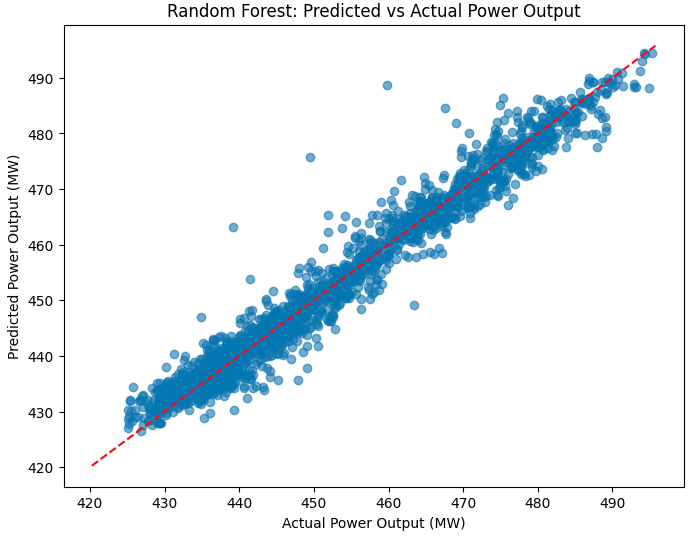

Final project for the Machine Learning Foundations for Product Managers course by Duke University.
Author: Federico Silvera

# Power Output Prediction with Machine Learning

This project applies machine learning techniques to predict the net hourly electrical power output (PE) of a Combined Cycle Power Plant (CCPP), based on environmental factors such as ambient temperature, pressure, humidity, and exhaust vacuum.

## Dataset

The dataset contains **9,568** samples collected from a power plant over a 6-year period. Each row includes:

- `AT` – Ambient Temperature (°C)
- `V`  – Exhaust Vacuum (cm Hg)
- `AP` – Ambient Pressure (millibar)
- `RH` – Relative Humidity (%)
- `PE` – Net Electrical Power Output (MW) → **target**

Source: UCI Machine Learning Repository - [CCPP Dataset](https://archive.ics.uci.edu/ml/datasets/Combined+Cycle+Power+Plant)

## Models Used

- **Linear Regression**
- **Random Forest Regressor**

## Evaluation Metrics

- **Root Mean Squared Error (RMSE)**
- **R² Score (Coefficient of Determination)**
- **Cross-validation (5-fold)**

## Results

| Model              | CV RMSE (Train) | Test RMSE | R² Score (Test) |
|--------------------|------------------|------------|------------------|
| Linear Regression  | 4.572 ± 0.080     | —          | —                |
| Random Forest      | 3.463 ± 0.150     | **3.239**  | **0.964**        |

**Random Forest** achieved the best results, with very high predictive performance on unseen data.

## Sample Visualization



> Plot showing predicted vs actual power output (PE) for the test set.

## How to Run

1. Clone this repo:
   ```bash
   git clone https://github.com/fedesilverauy/duke-ml-product-course-project.git
   cd ccpp-power-output


